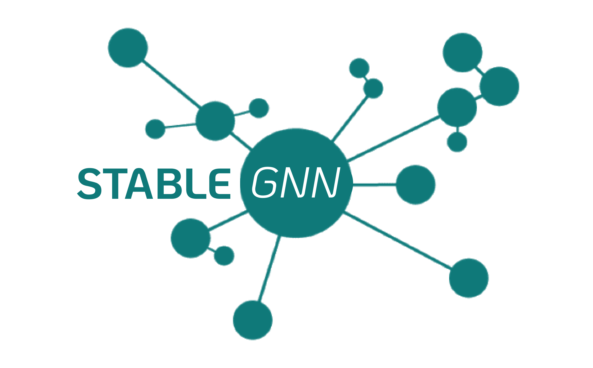

# StableGNN

<a href="link" style="text-align: center">
 </a>

This is a component for autonomous learning of explainable graph neural networks.


[](https://github.com/anpolol/StableGNN/actions/workflows/testing.yml)
[](https://anpolol.github.io/StableGNN/index.html)

## Installation
Python >= 3.9 is required

As a first step, [Pytorch Geometric installation](https://github.com/pyg-team/pytorch_geometric/) and Torch 1.1.2 are required.

#### PyTorch 1.12

```
# CUDA 10.2
conda install pytorch==1.12.1 torchvision==0.13.1 torchaudio==0.12.1 cudatoolkit=10.2 -c pytorch
# CUDA 11.3
conda install pytorch==1.12.1 torchvision==0.13.1 torchaudio==0.12.1 cudatoolkit=11.3 -c pytorch
# CUDA 11.6
conda install pytorch==1.12.1 torchvision==0.13.1 torchaudio==0.12.1 cudatoolkit=11.6 -c pytorch -c conda-forge
# CPU Only
conda install pytorch==1.12.1 torchvision==0.13.1 torchaudio==0.12.1 cpuonly -c pytorch
```

To install the PyTorch Geometric binaries for PyTorch 1.12.0, simply run


```
pip install pyg-lib torch-scatter torch-sparse -f https://data.pyg.org/whl/torch-1.12.0+${CUDA}.html
pip install torch-geometric
```

where `${CUDA}` should be replaced by either `cpu`, `cu102`, `cu113`, or `cu116` depending on your PyTorch installation.

|             | `cpu` | `cu102` | `cu113` | `cu116` |
|-------------|-------|---------|---------|---------|
| **Linux**   | ✅    | ✅      | ✅      | ✅      |
| **Windows** | ✅    |         | ✅      | ✅      |
| **macOS**   | ✅    |         |         |         |


When Torch and Torch Geometric are installed clone this repo and run inside repo directory:

```
pip install . 
```

To test the installation is sucessfull, run: 

```
python ./tests/test_install.py
```

## Library Highlights
It consists of three modules:
* Graph: reading input data and learning graph structure
* Model: predicting over nodes for disassortative graphs with high extrapolating ability 
* Explain: explanation of models results

Graph consists of 
* y - list of labels of all nodes in Graphs; dimension is (1,num_nodes)
* num_nodes - number of nodes in your graph
* x - attributes of dimension (num_nodes,d)
* d - dimension of attributes
* edge_index - edge list: (2,m) where m is the number of edges


## Quick Tour for New Users
First of all you need to save your raw data into folder 
```
DataValidation/dataset_name/raw
```
The data folder must contain three files: 

* **dataset_name_edges.txt** consists of two columns of nodes, each row of this table is a pair of vertices connected by an edge.
* **dataset_name_labels.txt** is a column of numbers, meaning labels of nodes. The size of this column is the size of input graph.
* **dataset_name_edge_attrs.txt** TODO


_To load data, run:_
```python
from StableGNN.Graph import Graph
import torch_geometric.transforms as T
root = 'DataValidation/'
name = dataset_name
adjust = True # flag to adjust Graph or not
data = Graph(name, root=root + str(dataset_name), transform=T.NormalizeFeatures(), adjust_flag=adjust)[0]
```
 
_To predict labels, run the model:_
TODO

_To build explanations of trained model, run:_
TODO


## Architecture Overview
**Adjusting** 

**Predicting**

**Explaining**

## Dependencies

## Contribution
To contribute this library, the current [code and documentation convention](wiki/Development.md) should be followed.
Project run linters and tests on each pull request, to install linters and testing-packages locally, run 

```
pip install -r requirements-dev.txt
```
To avoid any unnecessary commits please fix any linting and testing errors after running of the each linter:
- `pflake8 .`
- `black .`
- `isort .`
- `mypy StableGNN`
- `pytest tests`

## Citing

@inproceedings{mlg2022_5068,
title={Attributed Labeled BTER-Based Generative Model for Benchmarking of Graph Neural Networks},
author={Polina Andreeva, Egor Shikov and Claudie Bocheninа},
booktitle={Proceedings of the 17th International Workshop on Mining and Learning with Graphs (MLG)},
year={2022}
}
