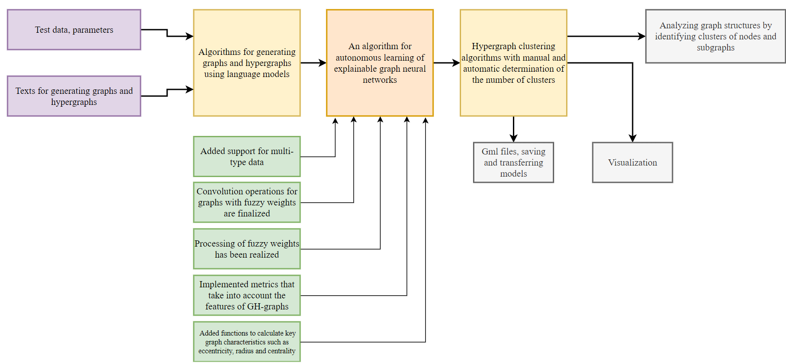

# StableGNN

<p align="center">
   
</p>

[](https://sai.itmo.ru/)
[](https://en.itmo.ru/en/)

[](https://github.com/anpolol/StableGNN/actions/workflows/tests.yml)
[](https://github.com/anpolol/StableGNN/actions/workflows/testing.yml)
[](https://aimclub.github.io/StableGNN/index.html)
[](https://github.com/aimclub/StableGNN/blob/main/LICENSE.md)
[](/README.md)
[](https://gitlab.actcognitive.org/itmo-sai-code/StableGNN)

This is a component for autonomous learning of explainable graph neural networks.


## Installation
Python >= 3.9 is required

As a first step, [Pytorch Geometric installation](https://github.com/pyg-team/pytorch_geometric/) and Torch 1.1.2 are required.

#### PyTorch 1.12

```
# CUDA 10.2
conda install pytorch==1.12.1 torchvision==0.13.1 torchaudio==0.12.1 cudatoolkit=10.2 -c pytorch
# CUDA 11.3
conda install pytorch==1.12.1 torchvision==0.13.1 torchaudio==0.12.1 cudatoolkit=11.3 -c pytorch
# CUDA 11.6
conda install pytorch==1.12.1 torchvision==0.13.1 torchaudio==0.12.1 cudatoolkit=11.6 -c pytorch -c conda-forge
# CPU Only
conda install pytorch==1.12.1 torchvision==0.13.1 torchaudio==0.12.1 cpuonly -c pytorch
```

To install the PyTorch Geometric binaries for PyTorch 1.12.0, simply run


```
pip install pyg-lib torch-scatter torch-sparse -f https://data.pyg.org/whl/torch-1.12.0+${CUDA}.html
pip install torch-geometric
```

where `${CUDA}` should be replaced by either `cpu`, `cu102`, `cu113`, or `cu116` depending on your PyTorch installation.

|             | `cpu` | `cu102` | `cu113` | `cu116` |
|-------------|-------|---------|---------|---------|
| **Linux**   | ✅    | ✅      | ✅      | ✅      |
| **Windows** | ✅    |         | ✅      | ✅      |
| **macOS**   | ✅    |         |         |         |


When Torch and Torch Geometric are installed clone this repo and run inside repo directory:

```
pip install . 
```

## Library Highlights
It consists of three modules:
* Graph: reading input data and learning graph structure
* Model: predicting over nodes for disassortative graphs with high extrapolating ability 
* Explain: explanation of models results
* GraphBuilder: generating graphs using Large Language Models (LLMs)
* HypergraphBuilder: generate hypergraphs using Large Language Models (LLM)

Graph consists of 
* y - list of labels of all nodes in Graphs; dimension is (1,num_nodes)
* num_nodes - number of nodes in your graph
* x - attributes of dimension (num_nodes,d)
* d - dimension of attributes
* edge_index - edge list: (2,m) where m is the number of edges


## Quick Tour for New Users
First of all you need to save your raw data into folder 
```
data_validation/dataset_name/raw
```
The data folder must contain two or three files if your task is Node Classification and N*2 files if your task is Graph Classification: 

* **edges.txt** consists of сomma-separated two columns of nodes, each row of this file is a pair of vertices connected by an edge.
* **labels.txt** is a column of numbers, meaning labels of nodes. The size of this column is the size of input graph.
* **attrs.txt** is comma-separeted file of lines of attributes of nodes. This file is optional, if the input Graph does not contain attributes, they will be generated randomly.

For dataset, consisting of many graphs, the same files are required, each file for each graph with postfix "_n.txt", where "n" is the index of the graphs, except "labels.txt", which is the only one for the whole dataset.
To adgust Graph with the graph learning algorithm, just set ```adjust_flag``` to ```True```. This option is avalilable only for the dataset consisting of one Graph (Node Classification task)

```python
from stable_gnn.graph import Graph
import torch_geometric.transforms as T

root = "../data_validation/"
name = dataset_name
adjust_flag = True 
data = Graph(name, root=root + str(dataset_name), transform=T.NormalizeFeatures(), adjust_flag=adjust_flag)[0]
```

For classification task, the pipeline for training is presented in the library in the module ```train_model_pipeline.py```. You can build your own pipeline inheriting from the Base ```TrainModel``` class or use classes from the same module for NodeClassification (```TrainModelNC```) and Graph Classification (```TrainModelGC```) tasks. Here ```loss_name``` is the name of loss function for unsupervised learning embeddings for the Geom-GCN layer, ```ssl_flag``` is the flag for using self-supervised loss function or not.

```python
import torch
from stable_gnn.pipelines.train_model_pipeline import TrainModelNC, TrainModelOptunaNC

device = torch.device('cuda' if torch.cuda.is_available() else 'cpu')

loss_name = 'APP'  # 'VERSE_Adj', 'LINE', 'HOPE_AA'
ssl_flag = True

optuna_training = TrainModelOptunaNC(data=data, device=device, ssl_flag=ssl_flag, loss_name=loss_name)
best_values = optuna_training.run(number_of_trials=100)
model_training = TrainModelNC(data=data, device=device, ssl_flag=ssl_flag, loss_name=loss_name)
_, train_acc_mi, train_acc_ma, test_acc_mi, test_acc_ma = model_training.run(best_values)
```

The similar is for Graph Classification task except of several parameters: ```extrapolation_flag``` is the flag for using extrapolation component or not.

```python
import torch
from stable_gnn.pipelines.train_model_pipeline import TrainModelGC, TrainModelOptunaGC

device = torch.device('cuda' if torch.cuda.is_available() else 'cpu')

ssl_flag = True
extrapolate_flag = True

optuna_training = TrainModelOptunaGC(data=data, device=device, ssl_flag=ssl_flag, extrapolate_flag=extrapolate_flag)
best_values = optuna_training.run(number_of_trials=100)
model_training = TrainModelGC(data=data, device=device, ssl_flag=ssl_flag, extrapolate_flag=extrapolate_flag)
_, train_acc_mi, train_acc_ma, test_acc_mi, test_acc_ma = model_training.run(best_values)
```

The explanations are now available only for NodeClassification task. After loading dataset with ``Graph`` class, features and adjacency matrix are saved to the ```.npy``` file and they now are needed to be load.   

```python
import os
import numpy as np
from torch_geometric.utils import to_dense_adj

from stable_gnn.explain import Explain

features = np.load(root + name + "/X.npy")
if os.path.exists(root + name + "/A.npy"): 
    adj_matrix = np.load(root + name + "/A.npy")
else:
    adj_matrix = torch.squeeze(to_dense_adj(data.edge_index.cpu())).numpy()

explainer = Explain(model=model_training, adj_matrix=adj_matrix, features=features)

pgm_explanation = explainer.structure_learning(34)
assert len(pgm_explanation.nodes) >= 2
assert len(pgm_explanation.edges) >= 1
print("explanations is", pgm_explanation.nodes, pgm_explanation.edges)
```

**Graph Generator** is a tool for automatic generation of graphs and hypergraphs from text data using modern large language models (LLM). The project allows you to analyze text, highlight key entities and their relationships, presenting them as structured graph data. This can be useful for a variety of fields including text analysis, natural language processing, social network research, and more besides.

The main components of the project are:

- **LLMClient**: A client for interacting with the language model via the Ollama API.
- **FineTuneClient**: Client for fine tuning models using the Transformers library.
- **DataProcessor**: Tools for pre-processing textual data.
- **Tests**: A set of unit tests to ensure that all components work correctly.

Before installing, make sure you have the following components installed:

- **Python**: Version 3.10 or higher.
- **pip**: Package manager for Python.
- Hardware requirements:

    - NVIDIA H100 GPU: Performing inference and fine-tuning models requires access to an NVIDIA H100 GPU for high performance and efficient processing.
    - CUDA: Make sure you have compatible versions of CUDA and NVIDIA drivers installed on your device to work with the H100 GPU.

#### Generating a graph from text

``python
from graph_generator.core.llm_client import LLMClient
from graph_generator.core.data_processor import DataProcessor

# Client initialization
data_processor = DataProcessor()
llm_client = LLMClient(model=“mistral:7b”, data_processor=data_processor)

# Input text
text = “Alexei met Ivan in the park. They went to a concert and then met Anna.”

# Graph generation
graph_description = llm_client.generate_graph_description(text)
print(graph_description)
```

**Expected output:**

``` ``json
{
    { “Alexei”: [“Ivan”, “Anna”,]
    “Ivan": [“Alexei”, “Anna”],
    { “Anna”: [“Ivan”, “Alexei”]
}
```

#### Generating a hypergraph from text

`` ``python
from graph_generator.core.llm_client import LLMClient
from graph_generator.core.data_processor import DataProcessor

# Client initialization
data_processor = DataProcessor()
llm_client = LLMClient(model=“mistral:7b”, data_processor=data_processor)

# Input text
text = “Alexei, Ivan and Anna went to a concert, and afterwards they all met at a cafe.”

# Hypergraph generation
hypergraph_description = llm_client.generate_hypergraph_description(text)
print(hypergraph_description)
```

**Expected output:**

`` ```json
{
    }, “hyperedge_1”: [ “Alexei”, “Ivan”, “Anna”.]
}
```

### Example 1: Hypergraph clustering with manual cluster number definition
```python
from hypergraph_clustering.utils.graph_conversion import hypergraph_to_incidence_matrix, incidence_to_adjacency
from hypergraph_clustering.clustering.agglomerative import AgglomerativeHypergraphClustering

# Пример гиперграфа
hyperedges = [[0, 1, 2], [1, 2, 3], [3, 4]]

# Преобразуем гиперграф в матрицы
incidence_matrix = hypergraph_to_incidence_matrix(hyperedges)
adjacency_matrix = incidence_to_adjacency(incidence_matrix)

# Кластеризация
clustering = AgglomerativeHypergraphClustering(n_clusters=2)
labels = clustering.fit(adjacency_matrix)

print("Clusters:", labels)
```

### Example 2: Automatic clustering number definition
```python
from hypergraph_clustering.clustering.auto_clustering import AutoClusterHypergraphClustering

clustering = AutoClusterHypergraphClustering(linkage="average", max_clusters=5, scoring="silhouette")
labels = clustering.fit(adjacency_matrix)

print("Clusters:", labels)
print("Best cluster number:", clustering.best_n_clusters)
print("Scoring:", clustering.best_score)
```


## Architecture Overview
StableGNN is the framework of Graph Neural Network solutions that provide increase of stability to noise data and increase the accuracy for out-of-distribution data. It consists of three parts:
 * graph - load and adjust data
 * model - based of geom-gcn, with ability to include self-superised loss function and extrapolation component
 * explain - explanations in the bayesian net form  


<p align="center">
   
</p>


## Algorithm modificatrion

<p align="center">
  
</p>

The modified algorithm for autonomous learning of explainable graph neural networks Graph Learning Network (GLN) has been extended with two new modules - graph generation and agglomerative clustering. These modules have significantly extended the capabilities of the algorithm by adding support for working with synthetic data and improving the interpretation of graph analysis results. They are seamlessly integrated into the algorithm structure, providing new tools for data preprocessing and analyzing complex graph structures.

The graph generation module is designed to generate test data in the form of GH-graphs that include dissimilar vertices, links and support fuzzy weights. This module allows you to specify graph parameters such as number of nodes, types of links and degree of sparsity, and generate graphs from textual descriptions using Ollama. The generation of synthetic data facilitates the testing of the algorithm and allows the simulation of scenarios that are difficult to reproduce on real data. The module is located in the stable_gnn/generation folder and serves as the main tool for preparing data for testing and training.

The agglomerative clustering module adds the ability to analyze graph structures by extracting clusters of nodes and subgraphs. This tool is adapted to work with GH graphs, taking into account their specific features such as data heterogeneity and fuzzy weights. It helps to identify hidden patterns in the structure of graphs, improving the interpretability of the model and generating new features for training. The module is located in the stable_gnn/clustering folder and is integrated into the training and data analysis process.

In addition, changes were made to existing algorithm files. In abstract_model.py, support for heterogeneous data has been added to accommodate the diversity of nodes and links in GH-graphs. In convs_factory.py, convolution operations have been refined so that they can handle graphs with fuzzy weights. In model_link_predict.py and model_nc.py files, the processing of fuzzy weights has been implemented and GH-graph-specific metrics have been introduced. Also, a new file gh_graph_utils.py was added, which contains functions for calculating key characteristics of graphs, such as eccentricity, radius and centrality, as well as for preparing data for clustering.

These modifications have significantly extended the capabilities of the GLN algorithm, improving its ability to handle heterogeneous and complex graph structures. The new modules and refinements provide more flexible data handling, improve the accuracy of analysis, and enhance the interpretation of results, making the algorithm a powerful tool for graph analysis and explainability tasks.

## Contribution
To contribute this library, the current [code and documentation convention](wiki/Development.md) should be followed.
Project run linters and tests on each pull request, to install linters and testing-packages locally, run 

```
pip install -r requirements-dev.txt
```
To avoid any unnecessary commits please fix any linting and testing errors after running of the each linter:
- `pflake8 .`
- `black .`
- `isort .`
- `mypy StableGNN`
- `pytest tests`

## Contacts
- [Contact development team](mailto:egorshikov@itmo.ru)
- Natural System Simulation Team <https://itmo-nss-team.github.io/>

## Suported by
The study is supported by the [Research Center Strong Artificial Intelligence in Industry](<https://sai.itmo.ru/>) 
of [ITMO University](https://en.itmo.ru/) as part of the plan of the center's program: Development and testing of an experimental prototype of a library of strong AI algorithms in terms of autonomous learning of explainable graph neural networks

## Citing
Please cite [our paper](http://www.mlgworkshop.org/2022/papers/MLG22_paper_5068.pdf) (and the respective papers of the methods used) if you use this code in your own work:
```
@inproceedings{mlg2022_5068,
title={Attributed Labeled BTER-Based Generative Model for Benchmarking of Graph Neural Networks},
author={Polina Andreeva, Egor Shikov and Claudie Bocheninа},
booktitle={Proceedings of the 17th International Workshop on Mining and Learning with Graphs (MLG)},
year={2022}
}
```
